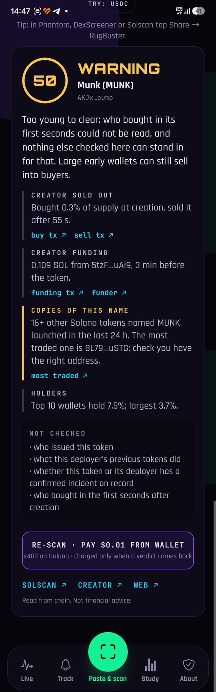
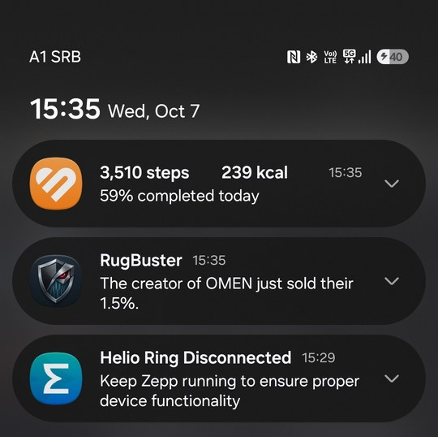

# RugBuster for Android

**Spot the creator dump before you buy.** A Solana token check for your phone, built for the Solana Mobile CLOCK IN hackathon.

On pump.fun-style launches, honest and dishonest tokens pass the same contract checks: the template revokes mint and freeze for everyone. RugBuster reads what the creator did with their own tokens instead. The creator's buy sits in the transaction that creates the token, so it is visible before anyone else can buy. In a study of 9,170 launches, 89% of creators who bought 1%+ of their token sold all of it within the first hour.

## What the app does

- **Scan** any Solana mint or link: verdict (DANGER / WARNING / NO FINDINGS), the reason, and every finding linked to its transaction on Solscan: the creator's buy and sell, the bots in the first five seconds, who funded the creator, the contract's powers and the holders. It also lists what it could not check; a gap is never shown as clean.
- **Share → RugBuster** from Phantom, DexScreener, Solscan or any browser: the app opens and scans the token you shared.
- **Track**: follow a token and get a notification the moment its creator sells, with the app closed. The RugBuster server watches the creator's wallet through a Helius webhook and pushes the alert over Firebase Cloud Messaging within seconds of the sale (since 1.7.0). The phone also re-checks in the background and reports a verdict that gets worse.
- **Copies of this name**: how many other Solana tokens took the same ticker in the last 24 hours, and which of them trades the most. A name that catches on gets dozens of copies within hours; this tells you the address matters (since 1.6.3).
- **Live**: what RugBuster has been seeing in the last 48 hours.
- **Pay $0.01 USDC per scan from your wallet** over x402 on Solana, signed through **Mobile Wallet Adapter**. The network fee is paid by the facilitator; you are charged only when a verdict comes back.
- The token's own logo rebuilt from particles, the same scene as rugbuster.io.





*A real alert, not a test. On 2026-10-07 the creator of OMEN sold the last of their tokens at 15:17 (Belgrade). The first push arrived right after the sale and was opened before anyone took a screenshot; this one, at 15:35, is the second, sent by the 10-minute fallback poll because re-registering the token on app start had re-armed it. That duplicate is fixed (one sale, one alert), and the wording is now "sold the 1.5% they still held".*

*MUNK, scanned on the phone on 2026-10-07. A day earlier this token read GOOD while a large wallet dumped it; the rule was fixed the same day (a token under 24 hours old whose first-seconds buyers cannot be read is not cleared), and the copies row was added after finding 27 tokens under the same ticker in two days.*

Everything a scan says comes from the public RugBuster API, which reads the chain live (Helius RPC), plus our own records of earlier launches. No AI writes the verdict.

## Download

Install the APK from the [latest release](https://github.com/rugbuster-mobile/rugbuster-mobile/releases/latest) ([direct download](https://github.com/rugbuster-mobile/rugbuster-mobile/releases/latest/download/RugBuster.apk)) on any Android phone (allow installs from your browser or file manager when asked).

## Build it yourself

Requirements: Node.js 20+, JDK 17, Android SDK (platform 35, build-tools 35).

```bash
npm install
npx expo prebuild --platform android
cd android
./gradlew assembleRelease -PreactNativeArchitectures=arm64-v8a
```

The APK is in `android/app/build/outputs/apk/release/app-release.apk`. Push alerts need a `google-services.json` from your own Firebase project in the repository root; without it the app builds and runs the same, and tracked tokens are re-checked on the phone only (`app.config.js` leaves the file out when it is missing). Without RugBuster's release key on your machine, the build signs with the debug key, which installs and runs the same; only the official release is signed with the key published in `https://rugbuster.io/.well-known/assetlinks.json`, which is how wallets verify the app over Mobile Wallet Adapter.

For development: `npx expo run:android` with a phone connected over USB.

## How it is put together

| Path | What it does |
|---|---|
| `App.tsx` | Tabs, share intent, scan / pay / track flow |
| `src/pay.ts` | x402 payment: 402 price quote → USDC transfer built for the facilitator → signed in the wallet via Mobile Wallet Adapter |
| `src/watch.ts` | Tracked tokens, background re-check (expo-background-task) and notifications |
| `src/push.ts` | Registers a tracked token with the API (`/watch`) for server push over Firebase Cloud Messaging |
| `src/facts.ts` | Turns the API answer into findings with Solscan proof links |
| `src/sphere.ts` | The particle sphere (Three.js in a WebView) |
| `src/net.ts` | Network calls that survive the round trip to the wallet app |
| `src/mint.ts` | Pulls a mint out of a pasted address or a Solscan / pump.fun / DexScreener link |

API used: `https://rugbuster-solana-api-production.up.railway.app` (`/score`, `/x402/score`, `/feed`, `/token-image`, `/perks`, `/watch`, `/unwatch`).

## Dependency audit

- `uuid` below 11.1.1 (GHSA-w5hq-g745-h8pq) came in through `jayson` and `xcode`; `package.json` overrides both to `uuid@^11.1.1`.
- `stream-json` 1.9.1 is still flagged. Only `jayson`'s server-side stream parser uses it; the app imports `@solana/web3.js`, which loads `jayson/lib/client/browser` and never that parser, so it is not in the app bundle. Its fixed releases (3.x) break that parser, so it is left as is rather than forced.
- The other `npm audit` entries are in Expo's build-time tooling, not in code that ships in the APK.

## Something not working?

Write in the Telegram group (https://t.me/rugbuster_community) or on Discord (https://discord.gg/v7nFJg7VyG), or open an issue here. The app has a "Report a problem" button under About and under every error.

## Links

- Web: https://rugbuster.io · Creator Trace: https://rugbuster-solana-api-production.up.railway.app/shield
- Study, data and API source: https://gitlab.com/rugbuster
- X: https://x.com/RugBusterAI

Built by Fedja Furduj (Belgrade). Read from chain. Not financial advice.

## Pitch deck

[RugBuster-CLOCK-IN-deck.pdf](docs/RugBuster-CLOCK-IN-deck.pdf)
